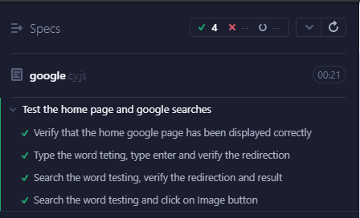

# QUBIKA exam project

Project started from 0 that allows to do some actions and verifications in Google.com

## Preconditions:
- You need to have Git downloaded to be able to clone the project. It's recommended to use GitHub Desktop. Click here to download -> (https://desktop.github.com/)
- You need to have a code editor installed. It's recommended to use Visual Studio Code. It can be downloaded from here -> (https://code.visualstudio.com/)
- You need to have NodeJs installed, it's recommended to have a version 16.17.0 +. Click here to download -> (https://nodejs.org/es)

## Instalation and test run
Once cloned and installed all the preconditions, you have to position in the root of the project from a console (it can be the one that includes VSC) and do [NPM INSTALL] After having installed all the packages, you must type in the console [NPX CYPRESS OPEN] and select E2E testing, select the browser that you need and select the test that you need run 
Check this page if you need more information https://docs.cypress.io/guides/getting-started/opening-the-app

## Solution
I made a simple but scalable structure, based on a POM model with a BasePage that should contain the basic actions like: send text, press a key, click, etc...

## Improvements
(To investigate) Apparently with the new versions of Google, the suggestions no longer appear, so it's not possible to make that case.

## Evidence

